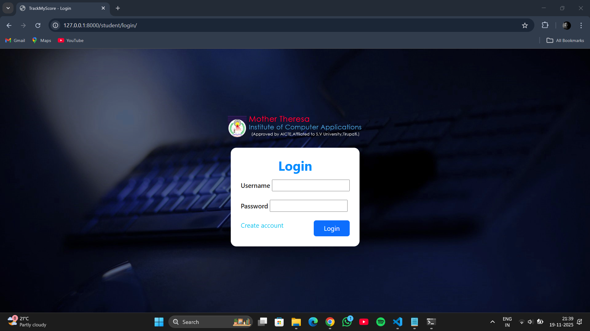
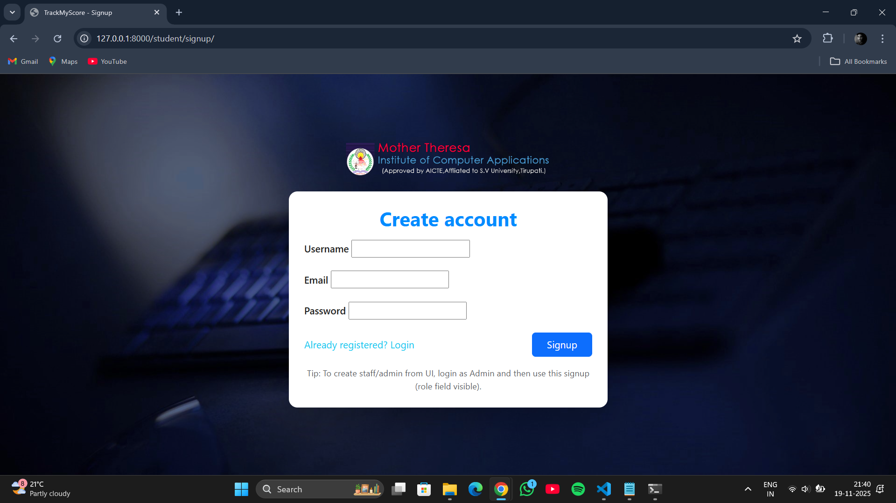
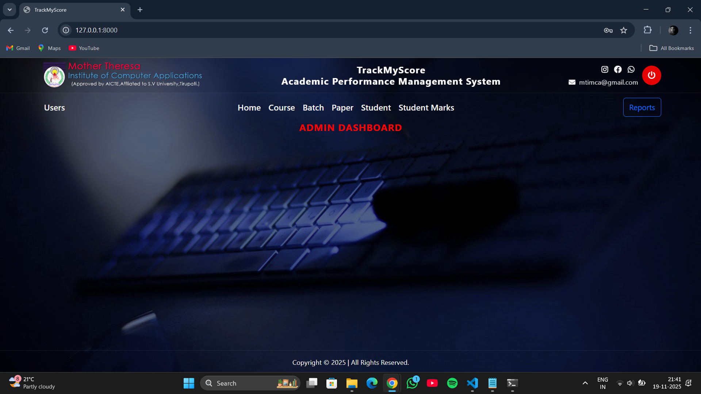
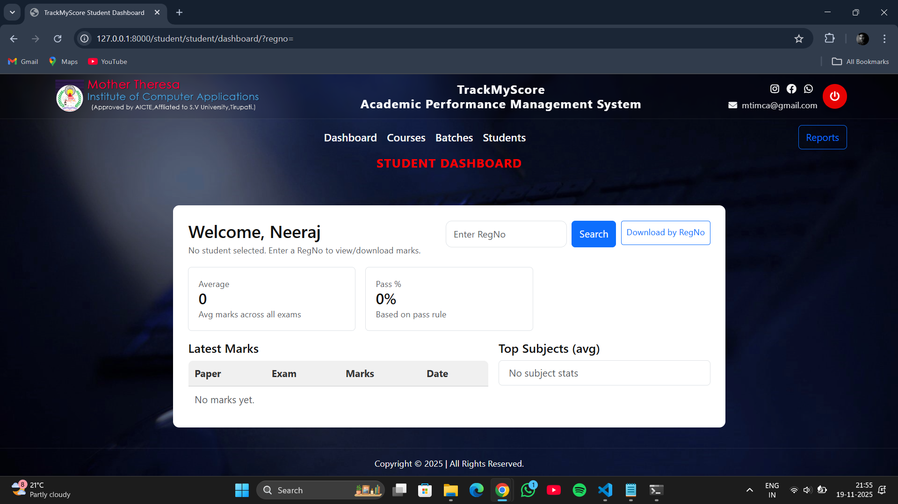
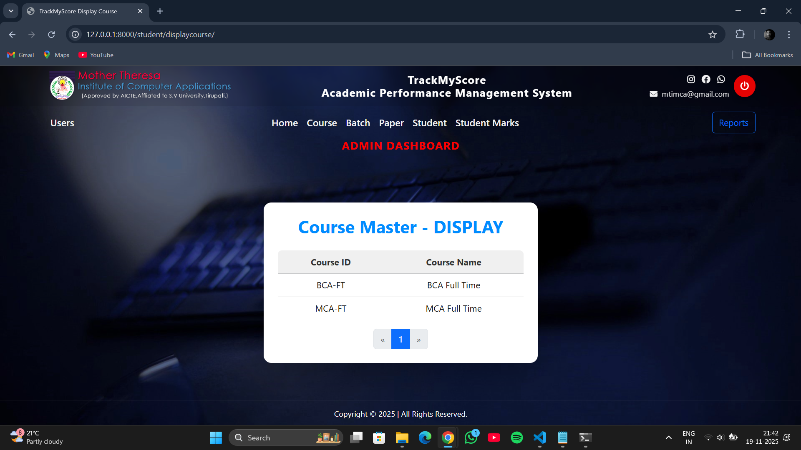
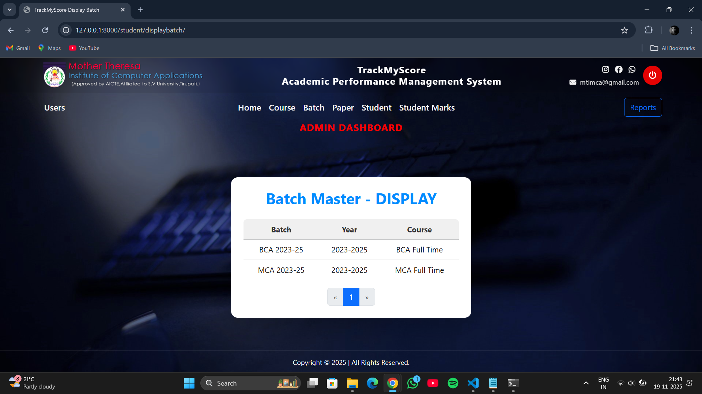
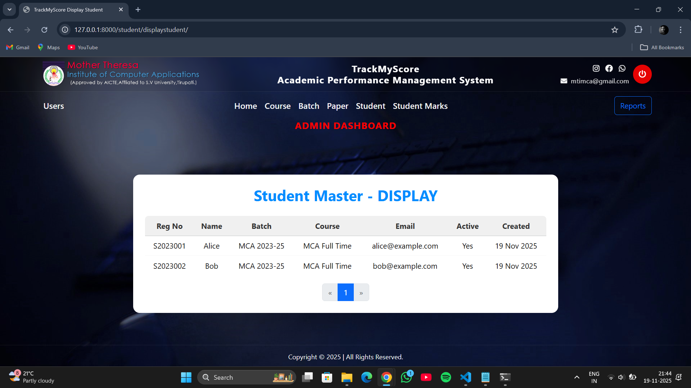
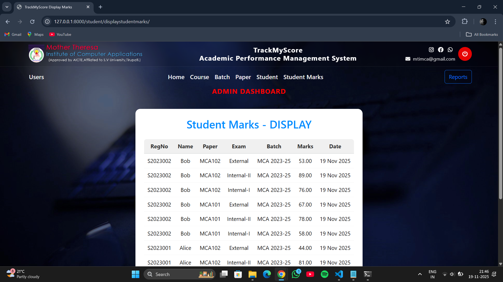
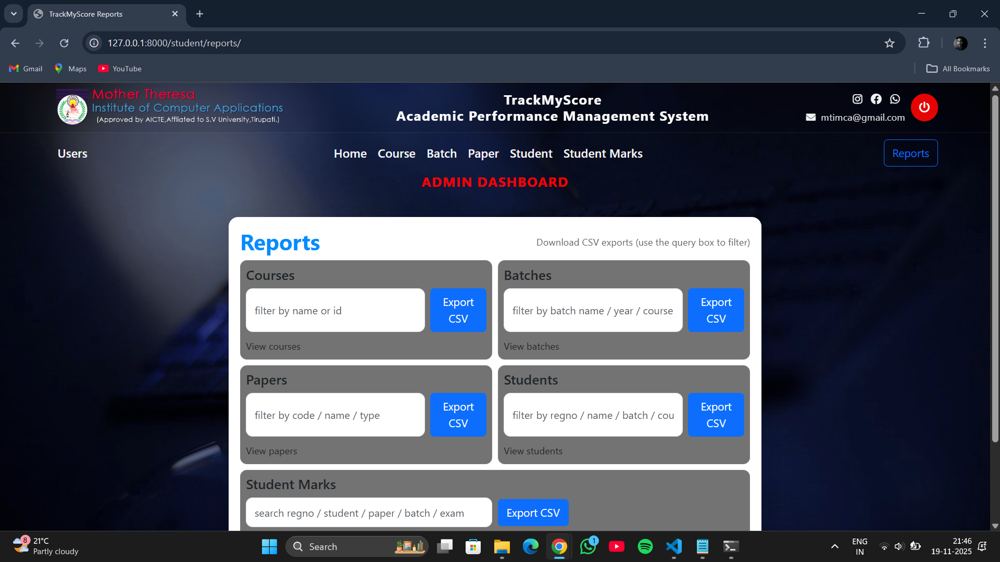
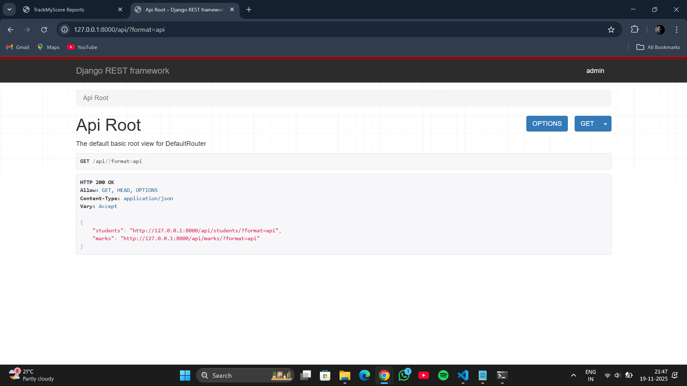

TrackMyScore – Academic Performance Management System

A full-stack Django + PostgreSQL web application to manage courses, batches, students, papers, and marks, with a clean UI, dashboards, CSV exports, and REST API support.

TrackMyScore is built to showcase:

✅ Django full-stack development
✅ PostgreSQL integration
✅ REST API (DRF)
✅ Authentication + Role-Based Access Control
✅ Admin/Staff/Student dashboards
✅ CSV Export for reporting
✅ Professional UI with Bootstrap 5

🚀 Features
🔐 Authentication & Roles

Login / Signup with clean UI

Roles: Admin, Staff, Student

Admin can create users with selected roles

Students view only their own records

🏫 Modules Included

Courses CRUD

Batches CRUD

Papers CRUD

Students CRUD

Student Marks CRUD

CSV Exports for all modules

Reports Home Page

📊 Student Dashboard

Latest marks

Average score

Test count

Pass percentage

Top performing subjects

Download personal marks (CSV)

Search ANY student’s report by RegNo

🛠 Admin/Staff Dashboard

Full system access

CSV exports

Manage all entities

View student performance

🧩 REST API (DRF)

/api/students/

/api/marks/
Supports:

GET

POST

JSON Format

🗄 Database

PostgreSQL

.env file support

Secure configuration

🛠 Tech Stack
Backend

Python 3.x

Django 5.x

Django REST Framework

PostgreSQL

Frontend

HTML, CSS

Bootstrap 5

FontAwesome

📂 Project Structure
TrackMyScore/
│── trackmyscore/           # Main project
│── student/                # All app files (models, views, etc.)
│── templates/              # HTML templates
│── static/                 # CSS, JS, images
│── api/                    # DRF serializers + views
│── .env                    # Environment variables
│── requirements.txt
│── manage.py
└── README.md

📸 Screenshots (Add your images here)

Upload images to GitHub → insert their links.

🔐 Login Page

📝 Signup Page

🛠 Admin Dashboard

🎓 Student Dashboard

📚 Course Management

📅 Batch Management

👨‍🎓 Student Management

📝 Student Marks

📊 Reports Page

🧩 REST API

⚙️ Installation Guide
1️⃣ Clone the Repository
git clone https://github.com/your-username/TrackMyScore.git
cd TrackMyScore

2️⃣ Create Virtual Environment
python -m venv env
env\Scripts\activate

3️⃣ Install Dependencies
pip install -r requirements.txt

🔐 Environment Variables (.env)

Create .env in project root:

DJANGO_SECRET_KEY=your-secret-key
DEBUG=True

TMS_DB_NAME=trackmyscore_db
TMS_DB_USER=tms_user
TMS_DB_PASS=yourpassword
TMS_DB_HOST=localhost
TMS_DB_PORT=5432

🗄 PostgreSQL Setup
CREATE DATABASE trackmyscore_db;
CREATE USER tms_user WITH PASSWORD 'yourpassword';
GRANT ALL PRIVILEGES ON DATABASE trackmyscore_db TO tms_user;

⚡ Run Migrations
python manage.py migrate

🧪 Load Sample Data (Optional)
python manage.py seed_sample_data

▶️ Run the Project
python manage.py runserver

🔌 REST API Endpoints
Students

GET all → /api/students/

POST new → /api/students/

Marks

GET all → /api/marks/

POST new → /api/marks/

📤 CSV Export Endpoints

/export/courses/

/export/batches/

/export/papers/

/export/students/

/export/marks/

🔮 Future Enhancements

PDF reports

Student mobile app

Automatic result notifications

Charts Dashboard

AI-based performance prediction

Deploy on Render / Railway

✨ Author

Neeraj Kumar (Nani)
TrackMyScore — 2025
